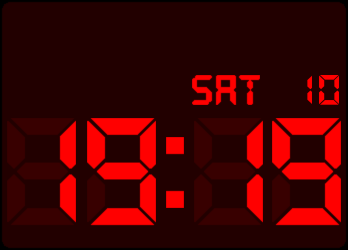

# LCD Clock Face

Fitbit SDK example application which looks like a retro LCD digital clock.

Uses images instead of fonts, and colors are configurable.

Find out more information on the
[Fitbit Developer Website](https://dev.fitbit.com).

## License

This example is licensed under the [MIT License](./LICENSE).
